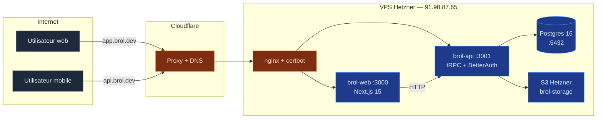
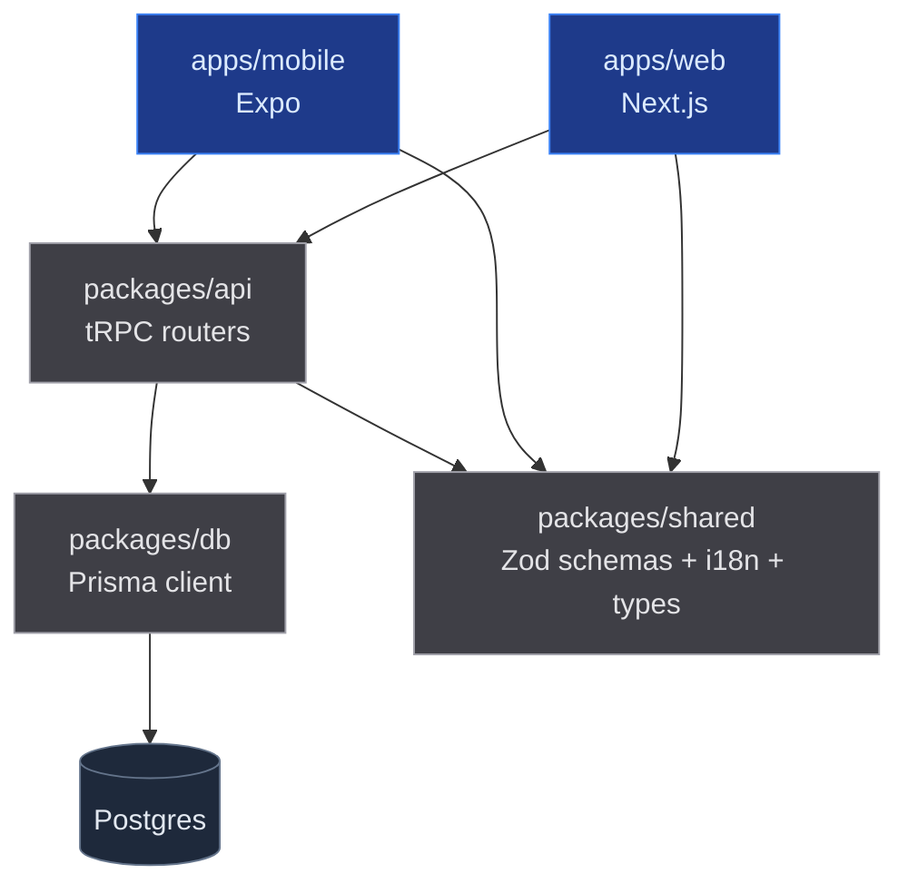
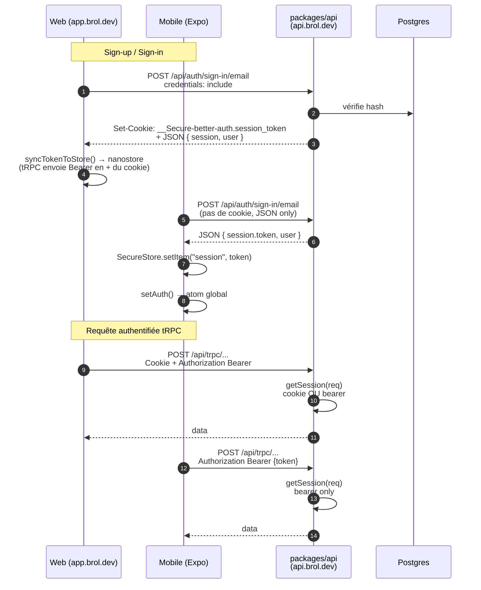
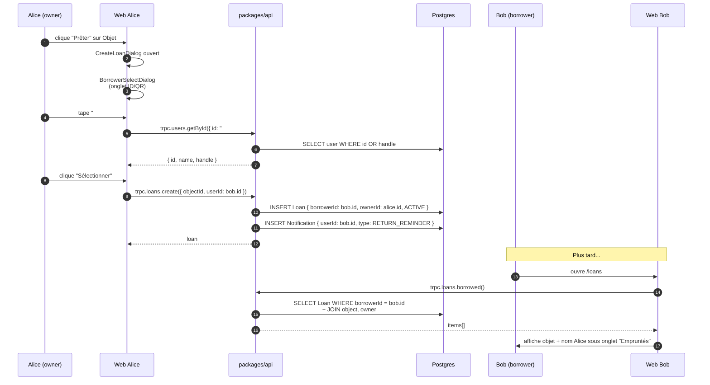
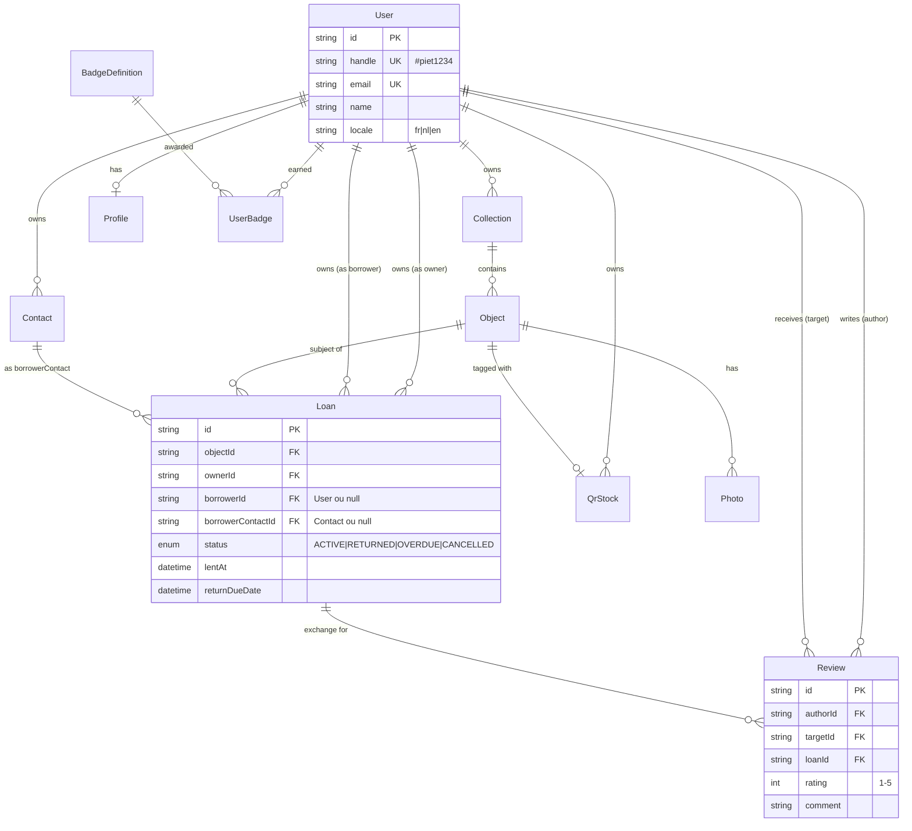
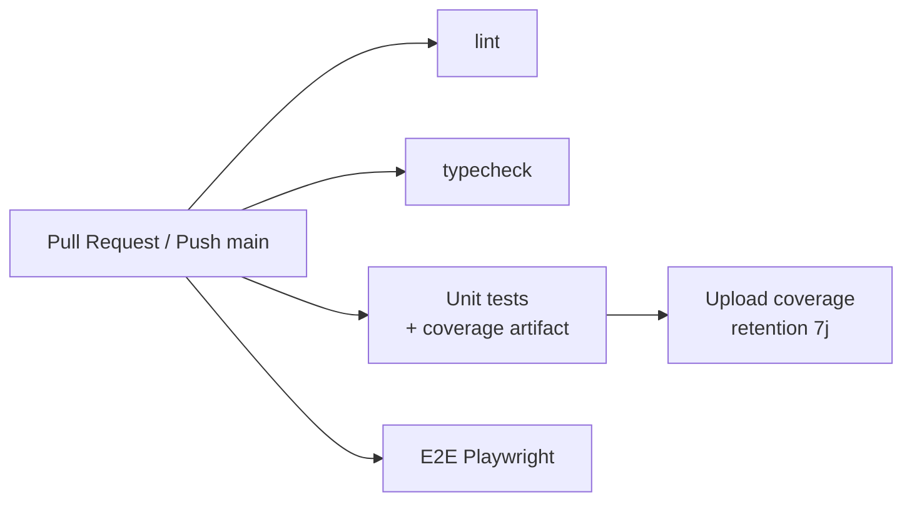

# ARCHITECTURE — Brol

Vue d'ensemble technique du monorepo. Diagrammes Mermaid (rendus par GitHub
et la plupart des éditeurs Markdown).

---

## 1. Topologie déploiement

---

## 2. Monorepo — dépendances entre packages

`@brol/shared` est consommé partout — pas de cycle. `@brol/db` est consommé
uniquement par `@brol/api` (les apps n'accèdent jamais à Prisma directement,
elles passent par tRPC).

---

## 3. Auth — flux cross-platform

Deux chemins, **même backend BetterAuth** côté API.

Détails clés :

- **Cookies cross-subdomain** en prod : `BETTER_AUTH_COOKIE_DOMAIN=.brol.dev`
  pour que le cookie posé par `api.brol.dev` soit lu par `app.brol.dev`.
- **Mobile = bearer token uniquement** : pas de cookies dans React Native →
  le token est sauvé dans `expo-secure-store` (Keychain/Keystore).
- **Hook `databaseHooks.user.create.after`** sur le serveur génère un
  `handle` (`#piet1234`) automatiquement à chaque signup.

---

## 4. Flux d'un prêt — owner → borrower

Cas spécial : si Bob n'a pas (encore) de compte Brol mais est dans les
contacts d'Alice avec `Contact.borrowerId = null`, le `Loan` pointe sur
`borrowerContactId` à la place — Bob ne verra rien jusqu'à ce que son
`Contact` soit lié à un compte (via email/téléphone match).

---

## 5. Modèle de données (sous-ensemble)

17 modèles au total (cf. `packages/db/prisma/schema.prisma`). Les modèles
auth BetterAuth (`Account`, `Session`, `VerificationToken`) sont omis pour
lisibilité.

---

## 6. Communautés du graphe de code

Extrait du graphe de connaissance produit par `/graphify` (415 nœuds, 145
communautés). Top 10 par taille :

| ID | Nom                         | Taille | God node     |
|----|-----------------------------|-------:|--------------|
| C0 | Mobile Auth & Session       | 32     | `syncSession` |
| C1 | Web Auth Pages              | 27     | `signInEmailPassword` |
| C2 | E2E Test Helpers            | 19     | `createUserAPI` |
| C3 | Utility Functions           | 16     | `formatDate` |
| C4 | Mobile API Client           | 14     | `getApiBase` |
| C5 | Coverage Report JS          | 14     | `getNthColumn` (auto-généré, ignorable) |
| C7 | S3 Storage                  | 11     | `getBucket` |
| C8 | Web Page Utilities          | 10     | `formatRelativeDate` |
| C9 | tRPC Server Handler         | 7      | `handleTrpc` |
| C11| Email Reminders             | 7      | `sendReminderEmail` |

Le god node `trpcCall()` (11 edges, le plus connecté du repo) ponte
**Mobile API Client ↔ Mobile Auth & Session** — c'est le seul endroit où
la couche transport touche au store de session. Tout changement de
sémantique d'auth doit passer par cette fonction.

---

## 7. Endpoints publics

| Surface       | Route                              | Description                    |
| ------------- | ---------------------------------- | ------------------------------ |
| Web           | `app.brol.dev/`                    | Dashboard                      |
| Web           | `app.brol.dev/browse`              | Collections publiques          |
| Web           | `app.brol.dev/profile/{handle}`    | Profil public via handle ou id |
| Web           | `app.brol.dev/qr/{code}`           | Page publique de scan QR       |
| API           | `api.brol.dev/api/auth/*`          | BetterAuth                     |
| API           | `api.brol.dev/api/trpc/*`          | Tous les routers tRPC          |
| API (test)    | `api.brol.dev/api/test/*`          | Endpoints de test (à gater en prod) |

⚠️ Les endpoints `/api/test/cleanup-user` et `/api/test/get-token` ne sont
**pas** gardés derrière `NODE_ENV !== "production"` — à corriger avant tout
déploiement nouveau (cf. AUDIT.md §5).

---

## 8. CI

Workflows GitHub Actions : `.github/workflows/ci.yml`.

Postgres 16 est démarré comme service container pour les jobs `Unit tests`
et `E2E`. Les deux installent les deps avec `pnpm install --frozen-lockfile`,
ce qui déclenche `postinstall` (`scripts/postinstall.sh`) → `prisma generate`
+ symlink `.prisma`.
